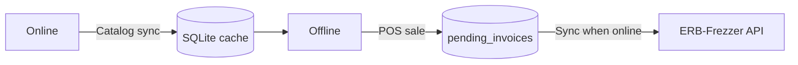
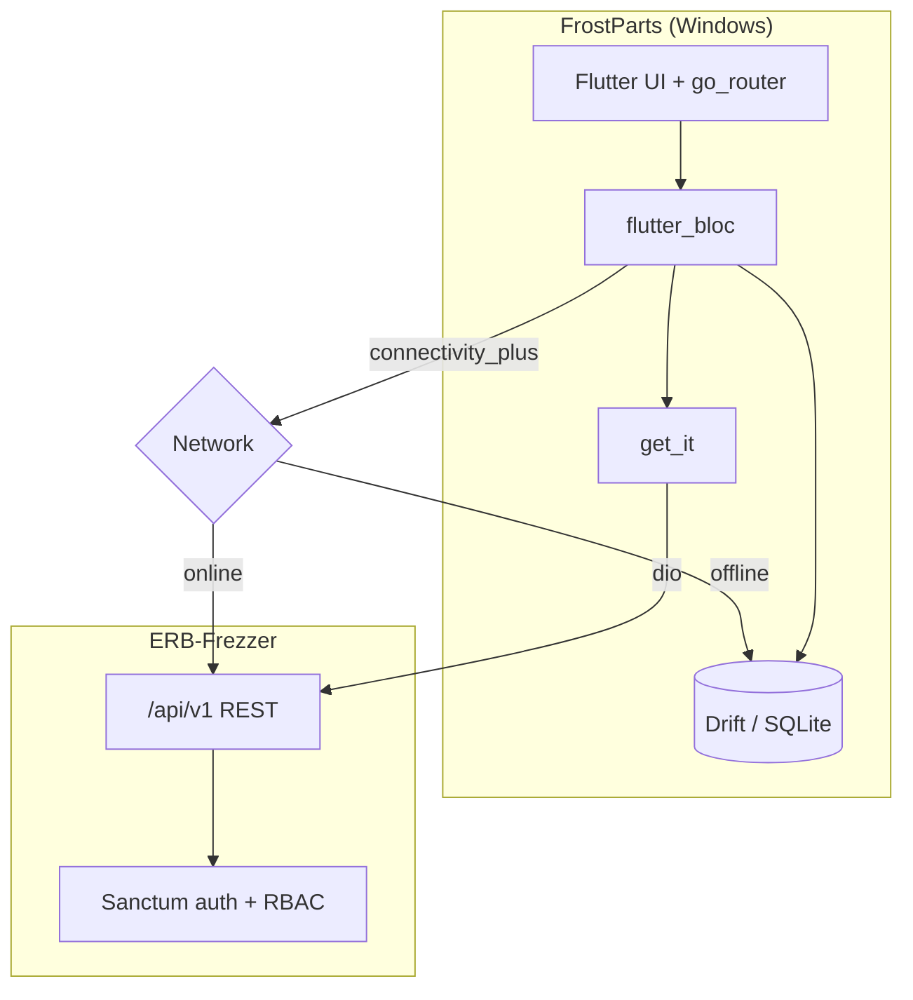

<div align="center">

# FrostParts

**Desktop ERP for auto-parts retail — built for Windows, powered by the ERB-Frezzer API**

[](https://flutter.dev)
[](https://docs.flutter.dev/platform-integration/windows/building)
[](https://dart.dev)
[](#)
[](https://github.com/mody258963)

Point-of-sale, inventory, finance, and reporting in one native Windows client — with offline sales and thermal receipt printing when the network drops.

[Features](#-features) · [Quick start](#-quick-start) · [Offline mode](#-offline-mode) · [Architecture](#-architecture) · [Project layout](#-project-layout)

</div>

---

## Overview

**FrostParts** (`erd_rezzer`) is the Windows desktop front-end for **ERB-Frezzer** — a Laravel ERP API exposed at `/api/v1`. Branch staff use it daily for catalog lookup, checkout, stock moves, and management dashboards; managers get KPIs, charts, and exportable reports without opening a browser.

| | |
|---|---|
| **Target** | Windows desktops in showrooms and warehouses |
| **Backend** | ERB-Frezzer REST API (auth, RBAC, business rules) |
| **Local data** | SQLite via Drift — catalog cache + queued invoices only |
| **Languages** | English & Arabic (RTL-ready UI) |

---

## Features

### Operations

| Module | What you get |
|--------|----------------|
| **Dashboard** | KPIs, daily profit, finance panels, activity timeline, parts sales charts |
| **POS** | Fast checkout, customer attach, receipt preview & print |
| **Parts & categories** | CRUD, images, per-part analysis, category management |
| **Inventory & transfers** | Stock levels, inter-branch transfers, branch finance |
| **Sales cycle** | Invoices, settlements, installments, returns (with approval flow) |
| **Purchasing** | Suppliers, purchase orders, receive & cancel |
| **Reports hub** | Sales, inventory, customers, suppliers, returns, parts sales chart |
| **Sync** | Push offline invoices when connectivity returns |

### Platform capabilities

- **Role-based access** — `admin`, `manager`, `salesperson`, `warehouse` see only what they need
- **Offline-first POS** — keep selling; sync when back online
- **ESC/POS printing** — Windows thermal printers for receipts
- **Secure session** — tokens in secure storage; API base URL configurable at login
- **Connectivity awareness** — banner + route guards when offline

---

## Quick start

### Prerequisites

- [Flutter SDK](https://docs.flutter.dev/get-started/install) (3.9+)
- Windows 10/11 with **Desktop development with C++** (Visual Studio Build Tools)
- A running **ERB-Frezzer** API instance (`php artisan serve` or your deployed URL)

### 1. Clone & install

```bash
git clone https://github.com/mody258963/erd-frezzer-windows-app.git
cd erd-frezzer-windows-app
flutter pub get
dart run build_runner build
```

### 2. Start the API

Run the Laravel backend (separate repo). Default local URL:

```text
http://127.0.0.1:8000
```

### 3. Run the app

```bash
flutter run -d windows
```

On the login screen, set the API URL if needed, then sign in with your seeded user (e.g. `admin@example.com` / `password` from the API seeder).

### Release build

```bash
flutter build windows --release
```

Output: `build\windows\x64\runner\Release\erd_rezzer.exe`

---

## Offline mode

When the network is unavailable, the app **restricts writes** to what matters on the shop floor:

| Allowed offline | Blocked offline |
|-----------------|-----------------|
| POS / new sales | Most admin & master-data screens |
| Pending sync queue | Live reports & dashboards that need API |
| Sales list (local) | Transfers, purchases, etc. |

1. Sales are stored locally in SQLite (`pending_invoices`).
2. Catalog is served from the last successful sync cache.
3. When online again, open **Sync** to `POST` queued invoices and refresh the catalog.



---

## Architecture



### Tech stack

| Layer | Packages |
|-------|----------|
| UI | Flutter Material, `google_fonts`, `fl_chart`, `data_table_2` |
| State | `flutter_bloc`, `equatable` |
| Navigation | `go_router` (auth, RBAC, offline guards) |
| Network | `dio`, `connectivity_plus` |
| Local DB | `drift`, `sqlite3_flutter_libs` |
| DI | `get_it` |
| Printing | `esc_pos_utils_plus`, custom Windows printer channel |
| i18n | `flutter_localizations` + generated `l10n` |

Regenerate Drift/JSON code after schema changes:

```bash
dart run build_runner build --delete-conflicting-outputs
```

---

## Project layout

```text
lib/
├── app.dart                 # MaterialApp + theme + l10n
├── main.dart                # Bootstrap, DI, printer reconnect
├── core/                    # Auth, connectivity, theme, printer, l10n helpers
├── data/                    # Models, repositories, Drift database
├── di/                      # get_it registration
├── features/                # Screens & blocs (dashboard, pos, reports, …)
├── router/                  # go_router + route paths
└── l10n/                    # AR / EN strings

windows/                     # Native runner & CMake
assets/                      # App imagery
```

---

## Roles at a glance

| Role | Typical access |
|------|----------------|
| **Admin** | Full system — settings, categories, all modules |
| **Manager** | Branches, finance, reports, approvals |
| **Salesperson** | POS, customers, sales; no warehouse-only flows |
| **Warehouse** | Inventory, transfers, parts; limited customer/POS |

Route and action guards live in `lib/core/auth/role_permissions.dart`.

---

## Configuration

| Setting | Where |
|---------|--------|
| API base URL | Login screen (persisted) |
| Thermal printer | Settings → Printer |
| Part categories | Settings → Part categories |
| Logging | `main.dart` — `Logger.root.level` |

---

## Related projects

| Repo | Role |
|------|------|
| **ERB-Frezzer** | Laravel API — source of truth for data & permissions |
| [**erd-frezzer-windows-app**](https://github.com/mody258963/erd-frezzer-windows-app) | Windows desktop client (this repo) |

---

## Contributing

1. Fork and create a feature branch.
2. Run `flutter analyze` and fix lints before opening a PR.
3. If you touch Drift tables or JSON models, run `build_runner` and commit generated files.

---

<div align="center">

**FrostParts** — sell parts, track stock, stay open when the Wi‑Fi doesn’t.

Made with Flutter for Windows · by [**Mohamed Ashmawy**](https://github.com/mody258963) ([@mody258963](https://github.com/mody258963))

</div>
